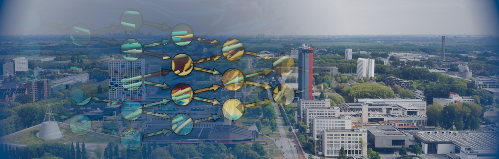

---
#
# By default, content added below the "---" mark will appear in the home page
# between the top bar and the list of recent posts.
# To change the home page layout, edit the _layouts/home.html file.
# See: https://jekyllrb.com/docs/themes/#overriding-theme-defaults
#
layout: home
---

  
  

    <h3>Workshop on Computational and Mathematical Methods in Data Science 2024</h3>
    
Delft University of Technology, April 25-26, 2024
    <a href="https://forms.gle/qCHRyh6GF3zJq1Pz6" target="_blank">Link to registration</a>
    

  

## About the Workshop

Welcome to the **Workshop on Computational and Mathematical Methods in Data Science 2024**. It is a meeting of the Dutch scientific machine learning community as well as the 2024 edition of the annual workshop of the [GAMM Activity Group on “Computational and Mathematical Methods in Data Science” (COMinDS)](https://www.tu-chemnitz.de/mathematik/wire/cominds/). The workshop is co-organized by the GAMM Activity Group and the [Strategic Research Initiative "Bridging Numerical Analysis and Machine Learning"](https://www.4tu.nl/ami/Research/sri-bridgingNAML/) of the the [4TU Applied Mathematics Institute (AMI)](https://www.4tu.nl/ami/). The workshop will be hosted by [Delft University of Technology](http://www.tudelft.nl/en/) and take place on April 25 and 26, 2024.

This workshop brings together scientists from mathematics, computer science, and application areas working on computational and mathematical methods in data science.

The meeting will be organized under the support of

+ the [4TU Applied Mathematics Institute (AMI)](https://www.4tu.nl/ami/) and
+ the [TU Delft Institute for Computational Science and Engineering (DCSE)](https://www.tudelft.nl/en/tu-delft-institute-for-computational-science-and-engineering).

## Registration

In order to participate in the GAMM LogoCOMinDS Workshop 2024, please **fill the <a href="https://forms.gle/qCHRyh6GF3zJq1Pz6" target="_blank">registration form</a> prior to April 1, 2024**. Registration is required for speakers as well as attendees without a contribution.

The registration fee is 100€, and it includes also the coffee breaks, lunches, and the conference dinner on Thursday, April 25.

If you have any questions or trouble with the registration, feel free to contact us via email at [a.heinlein@tudelft.nl](mailto:a.heinlein@tudelft.nl).

## Scientific Program

Confirmed keynote speakers:

+ [**Christoph Brune (University of Twente)**](https://people.utwente.nl/c.brune)   TBA
+ [**Victorita Dolean (TU Eindhoven)**](http://www.victoritadolean.com/)   [*Parallelization approaches for neural network-based collocation methods*](assets/pdf/abstract-dolean.pdf)
+ [**Olga Mula (TU Eindhoven)**](https://omula.gitlab.io/)   TBA
+ [**Thomas Richter (Otto von Guericke University Magdeburg)**](https://numerics.ovgu.de/)   TBA

**Thursday, 25. April 2024**

> **More information about the programme will follow soon.**

| Time (CEST) | Topic | Speaker |
| ----------- | ----------- | ----------- |
| 9.30 | Registration |  |
| 10.00 | Opening |  |
| 19.00 | Conference dinner | |

**Friday, 26. April 2024**

| Time (CEST) | Topic | Speaker |
| ----------- | ----------- | ----------- |
| 9.00 | Begin of the program |         |
| TBA       | End of the program   |         |

## Venue & Accommodation

The *Workshop on  Computational and Mathematical Methods in Data Science* will take place in the **Collegezaal** at the [Vakwerkhuis](https://vakwerkhuis.com/) close to the campus of the [Delft University of Technology](http://www.tudelft.nl/en/):

&nbsp;&nbsp;&nbsp;&nbsp;&nbsp;&nbsp;Vakwerkhuis  
&nbsp;&nbsp;&nbsp;&nbsp;&nbsp;&nbsp;Professor Snijdersstraat 2  
&nbsp;&nbsp;&nbsp;&nbsp;&nbsp;&nbsp;2628 RA Delft  
&nbsp;&nbsp;&nbsp;&nbsp;&nbsp;&nbsp;The Netherlands  

More information will follow. Click <a href="https://www.delft.com/planning-your-trip/getting-there" target="_blank">here</a> for information on how to get to Delft.

For accommodation, we recommend the following hotels:

| Hotel                                                        | Email                                                        | Address                                   | Booking                                                      |
| :----------------------------------------------------------- | ------------------------------------------------------------ | ----------------------------------------- | ------------------------------------------------------------ |
| [*Hampshire Hotel Delft Centre*](http://www.hoteldelftcentre.nl/) | [reservations@hoteldelftcentre.nl](mailto:reservations@hoteldelftcentre.nl) | Koepoortplaats 3  2612RR Delft       | [Booking link](https://sky-eu1.clock-software.com/spa/pms-wbe/#/hotel/10152?company_code=GuestofTUDelft2024&language=en&submit=true&adults=1&children=0) |
| [*Hotel De Plataan*](http://www.hoteldeplataan.nl/)          | [info@hoteldeplataan.nl](mailto:info@hoteldeplataan.nl)      | Doelenplein 10  2611BP Delft         | Discount code:  TUDELFT                                 |
| [*thesocialhub.co*](https://www.thesocialhub.co/delft/)      | [delft@thesocialhub.co](mailto:delft@thesocialhub.co)        | Van Leeuwenhoekpark 1  2611GW Delft  | Discount codes:  TSHPAOLA1 or FORYOU123                 |
| [*Hotel Casa Julia*](https://www.casajulia.nl/en)            | [reservations@casajulia.nl](mailto:reservations@casajulia.nl) | Maerten Trompstraat 33  2628RC Delft | [Booking link](https://app.mews.com/distributor/c56941db-946d-4fca-aad1-aa7300aceab3?mewsVoucherCode=TU%20Delft%20Workshop) |
| [*Hotel Leeuwenbrug Delft*](https://hotel-leeuwenbrug.business.site) |                                                              | Koornmarkt 16  2611 EE Delft         | Mention that you are a guest of TU Delft                     |
| [*Hotel Bridges House Delft*](https://www.guestreservations.com/hotel-bridges-house-delft/booking?msclkid=ad8d6fb16cd910fb20940a7a52b4eade) |                                                              | Oude Delft 74  2611 CD Delft         | Mention that you are a guest of TU Delft                     |
| [*Hotel Royal Bridges*](https://www.guestreservations.com/hotel-royal-bridges/booking?msclkid=7de49182f17e1282ce3af449cfd7c671) |                                                              | Koornmarkt 55-65  2611 EC Delft      | Mention that you are a guest of TU Delft                     |
| [*Hotel de Koophandel*](https://www.guestreservations.com/hotel-de-koophandel/booking?msclkid=452aeaca1228122dec328f012cf2b862) |                                                              | Beestenmarkt 30  2611 GC Delft       | Mention that you are a guest of TU Delft                     |

Using the **booking links/discount codes** in the column *Booking*, you will be able to **book a room at a reduced rate**.

## Local Organizing Committee

- [Dr. Alexander Heinlein](https://searhein.github.io) (TU Delft)
